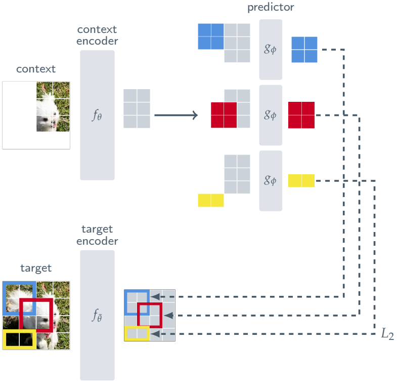

## Introduction

A key aspiration in artificial intelligence research is to build machines that not only see the world but also understand it in a manner similar to humans. Machines can now recognize objects and generate images with remarkable accuracy, yet they still struggle with one of the most natural aspects of human vision, is to understanding depth perception. Humans effortlessly infer three-dimensional structure from incomplete or ambiguous cues, grounding perception in a way that supports reasoning and decision-making. Most artificial systems, however, remain limited to flat inputs and deterministic models that cannot capture uncertainty or generalize flexibly across contexts.  

This project tackles this gap by introducing the Image-Depth Joint Embedding Predictive Architecture (ID-JEPA), the first JEPA model trained jointly on RGB and depth data. The aim is to teach machines not just to see, but to internalize spatial structure in a way that mirrors human perception. To push beyond deterministic prediction, the study incorporates a variational latent space into the JEPA predictor as there are still yet to exist a JEPA implementation incorporating Bayesian methods. Inspired by Variational Autoencoders, this design encodes knowledge into structured latent distributions, allowing the model to reason under uncertainty, interpolate between learned concepts, and build richer internal representations.  

## What is JEPA?
JEPA (Joint Embedding Predictive Architecture), introduced by Yann LeCun, is a self-supervised learning framework that learns abstract representations by predicting missing or masked information, not by reconstructing raw pixels, but by aligning high-level feature embeddings. This allows JEPA to focus on structure and meaning, making it more efficient and less prone to blurriness than traditional generative models.

I-JEPA applies this idea to vision tasks. The input image is split into:
* Context patches: visible parts of the image, used to infer the rest
* Target patches: masked (hidden) regions that the model must predict

The context patches are passed through a context encoder to extract features. These features are then fed into a predictor network, which attempts to estimate the features of the target patches. Meanwhile, the full image (including both context and target) is passed through a separate target encoder, which produces the ground-truth embeddings for the target regions.

The learning objective is to minimize the L2 loss between predicted and actual target embeddings in feature space. This teaches the model to infer meaningful representations of the missing content based on surrounding visual context. To stabilize training, the target encoder is not trained directly. Instead, it is updated as an exponential moving average (EMA) of the context encoder parameters—an approach inspired by momentum encoders in contrastive learning. I-JEPA implementations typically use Vision Transformers (ViTs) as both context and target encoders.

## Model's Structure and Mechanism 

### 1. Dataset
The primary dataset used will be NYU Depth V2, a widely-used RGB-D dataset consisting of indoor images captured with a Microsoft Kinect camera. It contains aligned RGB and depth sequences at 640×480 resolution, captured across various room types such as bedrooms, kitchens, and living rooms. 

### 2. Student and Teacher encoder
#### 2.1 The Student Encoder
The student encoder is based on a Vision Transformer (ViT) backbone and can be initialized either with pretrained weights or from scratch. When pretrained initialization is selected, weights from a publicly available DINOv2 model are loaded. 

#### 2.2 The Teacher Encoder
The teacher encoder is selected based on the chosen input modality. If an RGB image is used as input, the teacher encoder is initialized with pretrained weights from the DepthAnything model. Alternatively, if a depth map is used as input, the teacher encoder is instantiated using the same Vision Transformer (ViT)-based architecture as the student. Regardless of which encoder is selected, the teacher is set to evaluation mode, and its weights are frozen throughout training. Only the student encoder is updated via backpropagation.

### 3. ID-JEPA Model
The JEPA base module serves as the core component responsible for encoding inputs and generating masked token predictions. It takes an context-target pair as input, encodes them into patch-level embeddings, and constructs context and target representations based on a masking strategy. The sampled context embeddings and masked target tokens are then passed to the predictor module, which outputs reconstructed embeddings for the masked positions.

----------diagram--------------

The context input (RGB image) is first encoded by the pretrained student encoder, which produces patch embeddings.
During inference, this full embedding can be returned directly. During training, only part of the embedding is used:
1. A Context ratio is sampled within a predefined range.
2. Based on this ratio, a subset of patch tokens is randomly selected.
3. These selected tokens form the context block, which is passed to the predictor.
This teaches the model to reason about missing or unseen regions using only partial visual information.

The target input (depth image) is encoded by the pretrained teacher encoder, producing a sequence of depth feature embeddings. From these, the final-layer feature map is used as the target representation.
To create the masked prediction task:

1. A masking ratio is sampled to determine how many target tokens to hide.
2. A binary mask is generated to select the masked positions.
3. Positional embeddings are added to the mask tokens so that the predictor can infer where each missing patch belongs.
4. The ground-truth target blocks are constructed by slicing the teacher encoder output at the masked locations. These serve as the supervision signal during training.

The sampled context embeddings and the constructed target mask tokens are passed to the predictor module, which produces reconstructed embeddings for the masked positions.
The model returns both:
* Predicted embeddings (for masked tokens)
* Ground-truth target embeddings (from the teacher encoder)
These are used to compute the loss and train the model.

### 4. The Predictor

The Predictor module receives the context embeddings and target mask tokens, and produces predicted embeddings for the masked regions of the target input.

The two sets of tokens are first concatenated and passed through a linear bottleneck projection, which reduces their dimensionality. This bottleneck forces the encoders to do most of the representational work and helps prevent model collapse.

The projected sequence is then processed by a lightweight transformer, consisting of 8 blocks with multi-head self-attention layers. After encoding, the sequence is projected back to the original embedding dimension.

Finally, the module extracts the predicted embeddings for the masked target positions, which are then compared with the ground-truth target embeddings to compute the training loss.

### 5. The Variational Latent Predictor

#### 5.1 The Fusion Model
The Fusion module updates the context embeddings by incorporating information from a variational latent representation. It takes two inputs:

* A main sequence (the original context embeddings), and
* A secondary update sequence (latent-informed features)

The fusion is performed using an 8-head multi-head cross-attention layer. The context embeddings serve as the queries, while the latent features serve as both keys and values. This allows the model to selectively attend to relevant latent information when updating the context.

The attention output is added back to the original context embeddings via a residual connection, followed by layer normalization to stabilize training. The output is a fused context representation, enriched with information from the latent space, and used for downstream prediction.

#### 5.2 Updating the Context via Variational Inference
To enhance the model’s ability to reason under uncertainty, we introduce a variational latent space into the context encoding process.

The student encoder first processes the input image to produce context embeddings. These embeddings are then projected into a latent space by estimating a Gaussian distribution (mean and log-variance). Using the reparameterization trick, we sample latent variables that capture uncertainty-aware representations. A dropout mask is applied to the latent vectors during training, randomly zeroing out parts of the latent dimension.

--------diagram-------------

#### 5.3 Prediction using Updated Context
The sampled latent features are projected back to the original embedding dimension and fused with the original context embeddings via a multi-head cross-attention Fusion module. This yields a new fused context representation that incorporates latent information.

A subset of the fused context tokens is selected and combined with the target mask tokens (produced by the teacher encoder). The resulting sequence is passed into the Predictor module, which:

* Outputs predicted embeddings for the masked positions
* Retrieves ground-truth target embeddings from the teacher encoder
* Returns the latent parameters (mean and log-variance) used to compute the variational loss

-----diagram------

### 6. Depth Estimation Fine-Tuning
To evaluate the quality of the representations learned by ID-JEPA, we fine-tune the pretrained image encoder for metric depth prediction.

The fine-tuning architecture combines the ID-JEPA image encoder with a lightweight depth estimation head adapted from DPT-DINO. The encoder is initialized from a trained ID-JEPA checkpoint and kept frozen during fine-tuning to isolate the effect of learned features.

Input depth maps are converted to RGB-like format by stacking them across three channels, ensuring compatibility with the pretrained encoder. These inputs are processed by the encoder to produce feature embeddings, which are then passed to the depth head to generate a single-channel depth map.

The final output is resized as needed to match the ground-truth resolution. A sigmoid activation is used to constrain predictions to valid depth ranges.

## Project's codebase guide:

To download the dataset:
<pre>gdown --id 1WoOZOBpOWfmwe7bknWS5PMUCLBPFKTOw </pre>

To run model training visualization on tensorboard: 
<pre>tensorboard --logdir lightning_logs --port 6006 --host 0.0.0.0 </pre>
